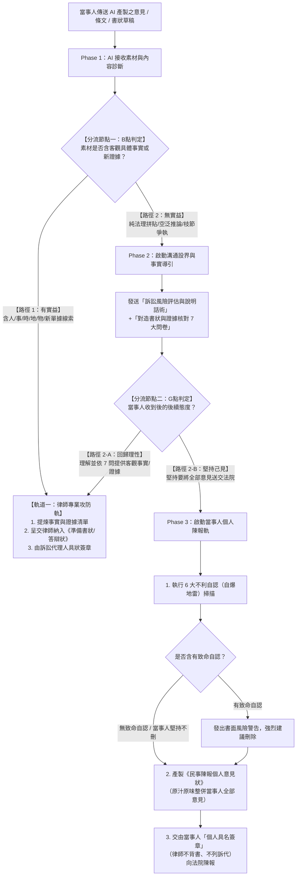

# 01_工作流程與執行計畫

---

## 🔄 一、兩階段雙軌分流標準架構圖（Master Workflow）

---

## 📋 二、分階段執行計畫（Execution Phases）

### 【Phase 1】接收素材與 B 點診斷（Ingestion & Diagnostic）
- **輸入**：當事人傳送之 LINE 訊息、Email、Word、ChatGPT 截圖或文字稿。
- **動作**：
  1. 讀取文字，調用 `02_任務分類與分流規則.md` 進行診斷。
  2. 判斷該素材是「純法理拼貼（走向路徑 2）」還是「含有可用客觀事實（走向路徑 1）」。
- **輸出**：向律師產出《B 點診斷簡報》，標註是否有新事實或新證據。

---

### 【Phase 2】溝通設界與事實導引（Communication & Fact Guidance）
- **觸發條件**：經 B 點判定為純空泛法理、理論拼貼或需核對對造書狀時。
- **動作**：
  1. 調用 `04_標準溝通話術與書狀範本.md` 之最新話術模組。
  2. 產出客製化回覆訊息，包含三大標準區塊：
     - 一、【關鍵證據評估與訴訟風險說明】（客觀評估證據，明確揭示不利認定與判決公開風險）
     - 二、【律師建議之訴訟方向】：（鎖定核心實質法律爭點，語氣審慎保留）
     - 三、【對造書狀與證據核對表】（附上 7 大問卷，包含引導行為用意與良善效果說明）
- **輸出**：可直接複製發送至 LINE 或 Email 的溝通訊息文字。

---

### 【Phase 3】G 點判定與交付產出（Routing & Deliverables）
根據當事人之回饋進行最終分流處理：

#### 🟢 狀況 A：當事人配合提供具體事實（走軌道一：律師專業攻防軌）
- 協助將當事人填寫之 7 問內容，整理為《訴訟事實與待證清單》。
- 呈交律師，由律師撰入正式之《民事準備書狀》或《民事答辯狀》，由**訴訟代理人具狀**。

#### 🔴 狀況 B：當事人堅持要遞交全部補充意見（走軌道二：當事人個人陳報軌）
- 調用 `03_品質檢查與不利自認過濾.md`，進行 6 大自爆地雷掃描：
  - 若有收受款項、承認簽名真正、侵權碰撞、時效中斷等文字，標註並向當事人發出警告。
- 調用 `04_標準溝通話術與書狀範本.md` 與 `民事陳報個人意見狀產製工具.html`：
  - 格式化為合規之《民事陳報個人意見狀》（20pt 標題、14pt 內文、1.5 倍行高、嚴格層次縮排）。
  - **嚴格確認**：具狀人為**當事人本人**，絕不列律師事務所或訴訟代理人。
